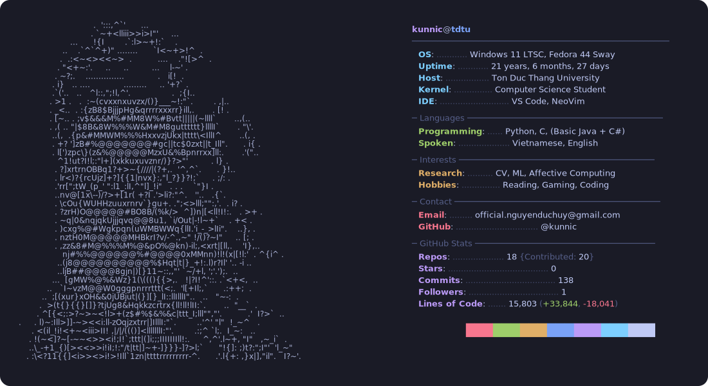

# ĐỨC-HUY (kunnic) NGUYỄN

<picture>
  <source media="(prefers-color-scheme: dark)" srcset="dark_mode.svg">
  <!-- <source media="(prefers-color-scheme: light)" srcset="light_mode.svg"> -->
  
</picture>

## Overview

Nguyễn Đức Huy is a final-year Computer Science student at Ton Duc Thang University in Ho Chi Minh City, Vietnam. He works at the intersection of technical curiosity, research discipline, and strong aesthetic taste — especially in Python, NLP-flavored research, and orchestral music production.[1]

He is the kind of person who can spend one part of the day thinking about dataset design and evaluation metrics, then spend the next shaping a symphonic mockup in Dorico, Cubase, and VSL. The through-line is always the same: taste matters, structure matters, and sloppy work is never the final form.[1]

## Who He Is

Huy, also known online as **Kunnic**, comes from Long An and studies in Ho Chi Minh City while navigating student life, an on-site internship, and a long list of self-imposed standards.[1] He reads technical material in both Vietnamese and English, prefers small high-trust circles over loud social scenes, and tends to approach learning as exploration first, obsession second.[1]

His personality leans analytical, perfectionistic, and highly self-aware. He thinks in systems, questions weak arguments, and constantly tries to close the gap between big architectural vision and real-world execution.[1]

## Focus Areas

- **Research and data work** — literature review, corpus thinking, annotation design, evaluation logic, and a strong preference for credible sources over noise.[1]
- **Python-first building** — modern typed Python, OOP, and pragmatic use of AI assistance to move faster without abandoning code quality ideals.[1]
- **NLP / affective computing curiosity** — especially projects related to language, emotion, and practical research output.[1]
- **Music technology** — orchestration, virtual instruments, mockup workflow, and the long-term ambition to stand somewhere between computer science and music.[1]
- **Hardware and self-reliance** — from repairing his own PC to building a workflow around tools he fully understands and controls.[1]

## Selected Projects

### VnLyricEmo
A Vietnamese song-lyric emotion classification corpus built around full-song annotation and Plutchik's eight primary emotions, aimed at becoming a solid resource paper rather than just another disposable student project.[1]

### Orchestral Medley Project
A long-horizon orchestral tribute project built for the third anniversary of his favorite actress, using Dorico for scoring and Cubase plus VSL Synchron for the final mockup. It is equal parts composition challenge, technical pipeline, and personal promise.[1]

### Chordie Clone in C
A pure C project that reads MIDI streams and displays chord names — compact, nerdy, and very on-brand for someone who likes music theory and low-level structure in the same sentence.[1]

### Blank-Page Detection Research
A synthetic computer-vision dataset project for evaluating blank-page detection methods, showing his tendency to turn niche problems into concrete experimental setups.[1]

## Working Style

Huy is most comfortable in environments where thinking is valued, expectations are clear, and the work has some intellectual texture.[1] He gravitates toward research-heavy or R&D-adjacent roles over repetitive production coding, and he prefers building proof through projects instead of selling a polished but empty personal brand.[1]

His style is curious but demanding: explore broadly, then lock in hard when something is worth mastering. That combination makes him less of a conventional grinder and more of a selective deep-diver.[1]

## Toolkit

- Python
- C
- Git
- Machine Learning / Deep Learning exposure
- LLM and Computer Vision exposure
- Dorico
- Cubase
- NotePerformer
- VSL Synchron ecosystem
- Literature review and technical reading in English/Vietnamese[1]

## Current Direction

Right now, the main arc is clear: finish the internship phase, push the VnLyricEmo paper toward a serious venue, prepare for a possible master's path, and keep building a portfolio that proves the builder can catch up with the architect.[1]

Long term, the target is not just employment. It is a body of work with identity: technically grounded, aesthetically sharp, and unmistakably personal.[1]

## Signals

- Final-year CS student at TDTU with a 7.74/10 GPA.[1]
- Strong interest in research, especially NLP, affective computing, and data-centric work.[1]
- Comfortable with both code and creative tooling, particularly in music-tech workflows.[1]
- Prefers depth, coherence, and credibility over hype.[1]
- Building toward a future where science, software, and musical sensibility can live in the same room.[1]

## One-Line Version

A research-minded CS student with sharp taste, strong curiosity, and a growing body of work across Python, NLP, and orchestral music-tech.[1]
